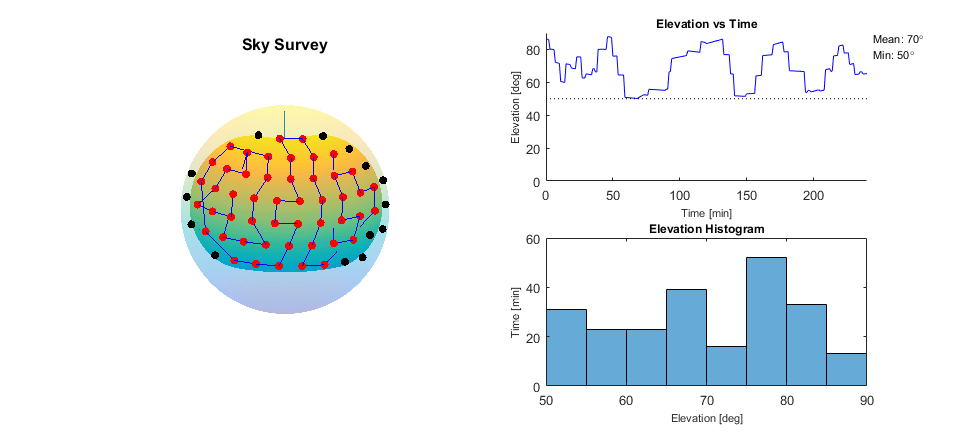

# Sky Survey
Given a set of test and equipment parameters, this generates a sky survey - an orientation trajectory that angles a camera to points of interest in the sky. 

A trajectory is a set of timestamped coordinates. In the equatorial coordinate system, this is a set of 1×3 vectors of the form: (time, right ascension, declination). Given multiple points of interest, we can generate different trajectories to pass through them depending on what we want to prioritize.

## Overview

Here’s a high-level view of the function:

    

The generated trajectory strives to do the following:

- Image as much of the visible sky as possible.
- Image points in the sky when they are at a higher elevation.
- Prioritize points that are close to one another.

These factors are weighed using a set of empirically-found tuning parameters.

Here’s a rough view of the sky survey logic:

    

Lastly, here is a visual of a generated sky survey. This survey had the following parameters:

- Minimum elevation: 50°
- Test time: 4 hours
- Camera field of view: 7.5° (half-cone)
- Latitude: 23° N
- Longitude: 79° W

    

Notes:
- The sphere represents the celestial sphere.
- The colored region represents the region of interest (the region of the sky visible over the test).
- The red dots indicate points along the trajectory, the black dots indicate points within the region of interest that we do not visit.
- The blue line indicates the path followed.
- The elevation plots on the right represent the elevation to which the mount is pointing.

## Nomenclature

$ \sum_{\forall i}{x_i^{2}} $