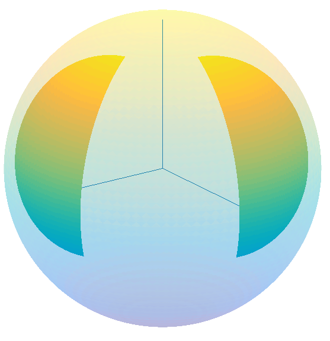
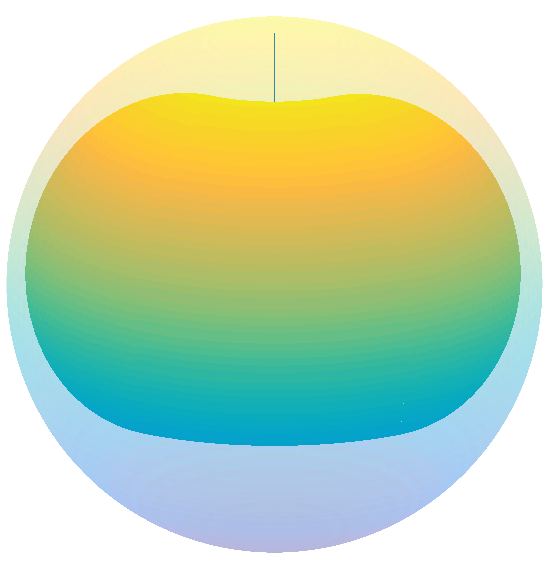
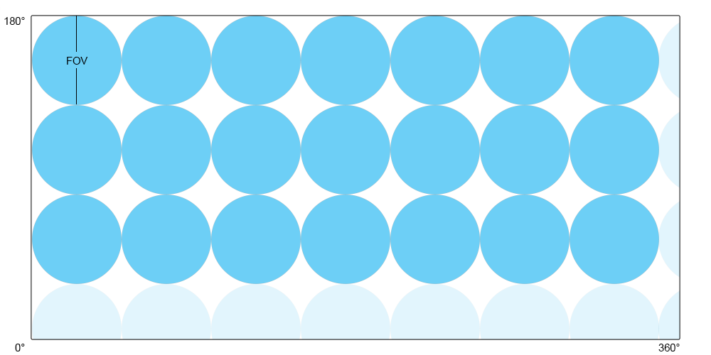
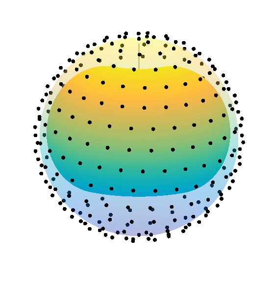
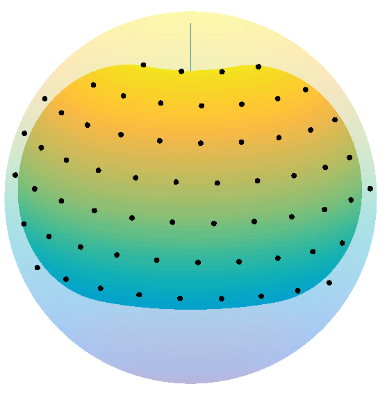
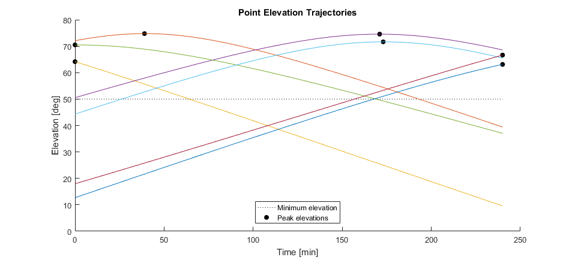
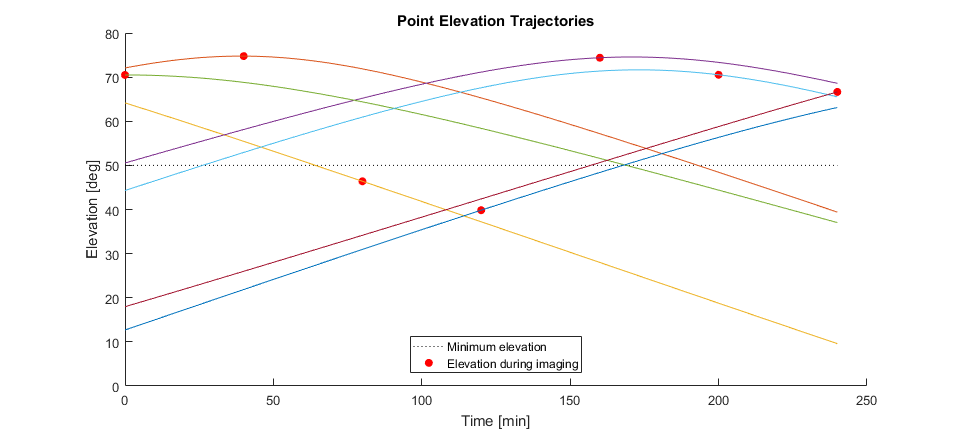
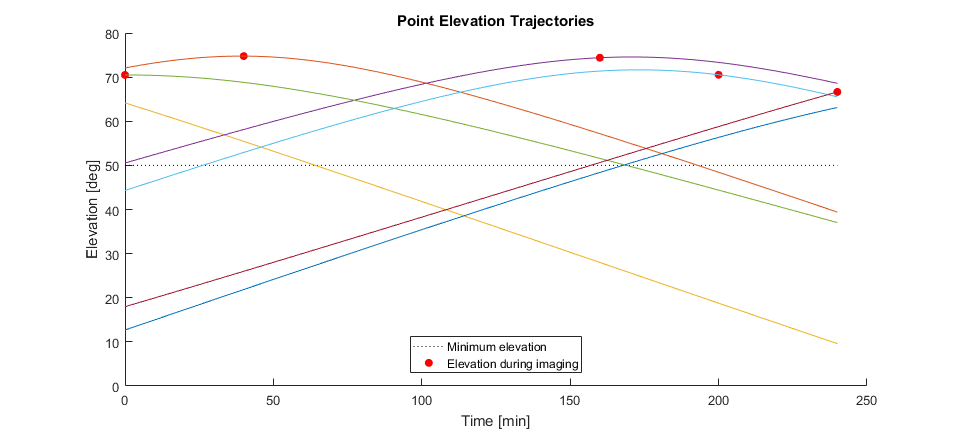

# Sky Survey
Given a set of test and equipment parameters, this generates a sky survey - an orientation trajectory that angles a camera to points of interest in the sky. 

A trajectory is a set of timestamped coordinates. In the equatorial coordinate system, this is a set of 1×3 vectors of the form: (time, right ascension, declination). Given multiple points of interest, we can generate different trajectories to pass through them depending on what we want to prioritize.

## Overview

Here’s a high-level view of the function:

    

The generated trajectory strives to do the following:

- Image as much of the visible sky as possible.
- Image points in the sky when they are at a higher elevation.
- Prioritize points that are close to one another.

These factors are weighed using a set of empirically-found tuning parameters.

Here’s a rough view of the sky survey logic:

    

Lastly, here is a visual of a generated sky survey. This survey had the following parameters:

- Minimum elevation: 50°
- Test time: 4 hours
- Camera field of view: 7.5° (half-cone)
- Latitude: 23° N
- Longitude: 79° W

    

Notes:
- The sphere represents the celestial sphere.
- The colored region represents the region of interest (the region of the sky visible over the test).
- The red dots indicate points along the trajectory, the black dots indicate points within the region of interest that we do not visit.
- The blue line indicates the path followed.
- The elevation plots on the right represent the elevation to which the mount is pointing.

## Region of Interest

### Azimuth-Elevation

We begin by dividing the celestial sphere into two half-hemispheres, one representing the start of the region of interest, one representing the end. Each hemisphere spans 180deg in azimuth and (90deg - min_elevation) in elevation. 

For example:

    

### Right Ascension – Declination

We convert the start region to right ascension and declination, using the observer’s geographic position and the time at the start of the test. We repeat the process with the end region, but use the time at the end of the test. Given a 4 hour test at latitude-longitude coordinates (23, -79) with a minimum elevation of 50°:

    

where the inertial frame axes are shown as lines. The faded out sphere represents the entire celestial sphere, while the colored-in region represents the parts that will be visible over the course of the test. The radius of each region represents the observer’s local horizon (at the time), taking into account the specified minimum elevation.

Since the Earth’s rotation only affects the right ascension of the local horizon, we can fill in the intermediate region of the sky by keeping the declination constant:

    

The colored area is the region of interest – the part of the night sky that will be visible over the course of the test given its initial parameters.

## Points of Interest

A camera has a more limited field of view than the visible sky. So we divide the sky into smaller hemispheres whose diameters are equal to the camera’s field of view. Each of these hemispheres represents an image and is kept track of as a point on the celestial sphere representing its center.

There’s some flexibility in the number and coordinates of these points. One approach is to generate a uniform distribution of points along the sphere’s surface, then remove any points lying outside of the ROI. The number of points can be found by calculating how many circles with a diameter of the camera’s FOV will fit into a rectangle whose dimensions represent the entire celestial sphere.

    

In the image above (not to scale), each blue circle represents an image that fits entirely into the celestial sphere. The faded out circles are discarded, since if they were allowed, they would overlap with the circles on the opposite sides of the rectangle (given that this represents a sphere, each dimension wraps around back to 0°). This approach leaves areas of the sphere unimaged, but given a sufficiently small FOV (as well as some tricks we employ later on to allow each point to shift a bit while we image), this provides adequate coverage.

For a half-cone FOV of 7.5° (full-cone of 15°), this looks like:

    

We remove points outside of the ROI by calculating the elevation of each point over the course of the test. If a point is ever above the minimum elevation, it is stored. Otherwise it is discarded. After doing this, the sphere above looks like:

    

## Trajectory Generation

Images closer to the zenith are assumed to experience less atmospheric distortion, so we prefer to view points in the ROI when they are at their highest elevation. However, simply planning to view each point when it is at its apex is unfeasible, since many points reach their apex at the same time (end or start of the test usually). This can be seen in the sample elevation trajectories for the 7 points below:

    

Note, this trajectory is not related to the ROI shown above. That has 63 points, which would lead to a very crowded elevation trajectory chart.

Instead, we generate a uniform time distribution over the test such that we visit each point in the ROI for the same amount of time. We then order the points in decreasing order of peak elevation and assign each point to the nearest, unused time in the distribution. The result of this is an elevation trajectory, albeit with some points below the minimum elevation.

    

Note, the red points indicate when we image a given point. Since we point our mount to a given set of equatorial coordinates, between subsequent points we follow the elevation trajectory of the latest point we imaged.

We then remove any points that are below the minimum elevation from our trajectory:

    

This results in some points being thrown out (typically these points exist at the edge of our ROI). There is a setting in the `tuning` structure called `prioritize_high_elevations` which, if set to false, will attempt to swap around points in order to image those points that fall below the minimum elevation. While this results in more imaged points, it lowers the mean elevation at which we image points.

## Trajectory Optimization

Coming soon...